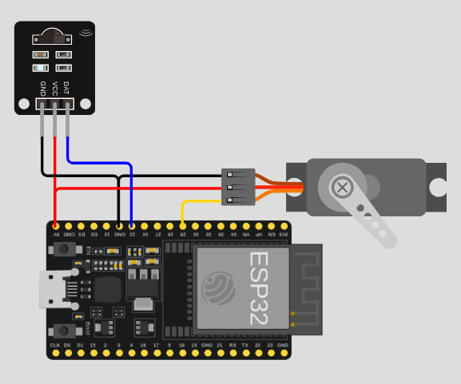

# **Sistema de Controle de Leito via Infravermelho**

**Descrição:**  
Este projeto apresenta um sistema simples para ajustar a inclinação de uma cama
hospitalar utilizando um controle remoto infravermelho (IR), que é acessível para
pacientes, especialmente aqueles com mobilidade limitada. A implementação consiste
em um sensor IR que recebe os pulsos do controle remoto e um servo motor que simula
o mecanismo de ajuste da cama. O sistema pode ser facilmente expandido para 
controlar outros recursos da sala do paciente, como iluminação, ventilação e dispositivos
de entretenimento, permitindo um ambiente mais confortável e acessível, essencial
para a recuperação de pacientes com baixa mobilidade.

---

## Índice

1. [Introdução](#introdução)  
2. [Requisitos](#requisitos)  
3. [Configuração do Ambiente](#configuração-do-ambiente)  
4. [Montagem do Circuito](#montagem-do-circuito)  
5. [Programação](#programação)  
6. [Teste e Validação](#teste-e-validação)  
7. [Expansões e Melhorias](#expansões-e-melhorias)  
8. [Referências](#referências)

---

## Introdução

O conforto e a autonomia dos pacientes hospitalares, especialmente aqueles
com baixa mobilidade, são fundamentais para o processo de recuperação. Ajustar
a posição da cama pode proporcionar alívio, melhorar a ventilação e facilitar
o atendimento de saúde. Além disso, em ambientes de hospital ou clínicas,
é importante ter sistemas que não apenas ajustem a cama, mas também ofereçam
controle fácil de outros dispositivos no quarto, como luzes, ventiladores ou 
parelhos de entretenimento, sem que o paciente precise de auxílio direto da equipe.

Este projeto utiliza um controle remoto infravermelho para ajustar a inclinação
de uma cama hospitalar. A implementação é baseada no microcontrolador ESP32,
utilizando as bibliotecas **ESP32Servo** para controlar o servo motor (que simula o ajuste da cama)
e **IRremote** para receber os sinais do controle remoto. Embora o modelo básico do sistema
controle apenas a inclinação da cama, ele pode ser facilmente expandido 
para controlar outros recursos na sala do paciente, aumentando a acessibilidade 
para pacientes com mobilidade limitada.

---

## Requisitos

### Hardware

- **Placa**: ESP32  
- **Sensor IR**: Receptor infravermelho 
- **Motor**: Servo Motor  
- **Controle IR**: Controle remoto infravermelho

### Software

- **IDE**: Arduino IDE  
- **Bibliotecas**:  
  - **ESP32Servo** por Kevin Harrington, John K. Bennett
  - **IRremote** por shirriff, z3t0, ArminJo

---

## Configuração do Ambiente

### Passo 1: Instalação do Software

- **Arduino IDE**: Caso ainda não tenha a IDE instalada, baixe e instale a versão mais recente 
[aqui](https://www.arduino.cc/en/software).

- **ESP32 no Arduino IDE**: Para instalar o suporte ao ESP32 na IDE, siga os passos abaixo:
  1. Abra a IDE do Arduino e vá em **Arquivo** > **Preferências**.
  2. No campo **URLs adicionais para Gerenciadores de Placas**, adicione o seguinte link:
     ```
     https://dl.espressif.com/dl/package_esp32_index.json
     ```
  3. Vá em **Ferramentas** > **Placa** > **Gerenciador de Placas** e busque por "esp32". Clique em **Instalar**.

### Passo 2: Instalação das Bibliotecas

Para instalar as bibliotecas necessárias, abra o menu **Sketch** > **Incluir Bibliotecas** > **Gerenciar Bibliotecas**.
Na caixa de diálogo do Gerenciador de Bibliotecas, busque e instale as bibliotecas:
- **ESP32Servo**  
- **IRremote**

---

## Montagem do Circuito

1. **Receptor IR**:  
   - **VCC**: Conecte ao pino 3.3V do ESP32  
   - **GND**: Conecte ao pino GND do ESP32  
   - **DAT**: Conecte ao pino GPIO 12 (ou outro pino digital)

2. **Servo Motor**:  
   - **VCC**: Conecte ao pino de VIN do ESP32
   - **GND**: Conecte ao GND do ESP32
   - **PWM**: Conecte ao pino GPIO 25 (ou outro pino digital)

<p align="center">
    
</p>

---

## Programação

### Passo 1: Importando as Bibliotecas

```cpp
#include <IRremote.h>
#include <ESP32Servo.h>
```

### Passo 2: Definindo Variáveis e Pinos

```cpp
#include <IRremote.h>       // inclui as bibliotecas necessárias
#include <ESP32Servo.h>

const int IR_PIN = 12;      // pino de dados do sensor IR
const int SERVO_PIN = 25;   // pino PWM do servo motor

const int ANGULO_INCR = 5;  // variação de ângulo por comando

IRrecv sensor_ir(IR_PIN);
Servo servo;
```

### Passo 3: Configurando o Setup

```cpp
void setup() {
  Serial.begin(115200);     // inicializa a saída Serial
  sensor_ir.enableIRIn();   // inicializa o sensor IR

  servo.attach(SERVO_PIN, 500, 2400);   // configura o servo motor
  servo.write(0);                       // ajusta a posição inicial do servo

  Serial.println("Sistema inicializado");
}
```

### Passo 4: Controlando a posição do Servo
```cpp
void ajustar_angulacao(int graus) {
  int novo_angulo = servo.read() + graus;   // acessa o angulo atual e calcula o novo angulo do servo
  servo.write(novo_angulo);                 // posiciona o servo na nova angulação
  
  Serial.print("Angulação: ");              // registra o novo ângulo do servo motor
  Serial.println(novo_angulo);
}
```

### Passo 5: Lendo o Controle IR

```cpp
if (sensor_ir.decode()) {       // verifica se algum comando foi enviado
    processar_comando();        // executa comando
    sensor_ir.resume();         // prepara para buscar o próximo comando
}
```

### Passo 6: Executando o comando enviado

```cpp
void processar_comando() {
  int comando = sensor_ir.decodedIRData.command;    // acessa o comando enviado

  switch(comando) {
    case 2:                             // botão '+' foi apertado
      ajustar_angulacao(ANGULO_INCR);   // aumenta inclinação da cama
      break;
    case 152:                           // botão '-' foi apertado
      ajustar_angulacao(-ANGULO_INCR);  // reduz inclinação da cama
      break;
    default:                            // registra comandos não reconhecidos
      Serial.print("Comando não reconhecido: ");
      Serial.println(comando);
  }
}
```

### Passo 7: Código Completo

```cpp
#include <IRremote.h>
#include <ESP32Servo.h>

const int IR_PIN = 12;      // pino de dados do sensor IR
const int SERVO_PIN = 25;   // pino PWM do servo motor

const int ANGULO_INCR = 5;  // variação de ângulo por comando

IRrecv sensor_ir(IR_PIN);
Servo servo;

void setup() {
  Serial.begin(115200);     // inicializa a saída Serial
  sensor_ir.enableIRIn();   // inicializa o sensor IR

  servo.attach(SERVO_PIN, 500, 2400);   // configura o servo motor
  servo.write(0);                       // ajusta a posição inicial do servo

  Serial.println("Sistema inicializado");
}

void loop() {
  if (sensor_ir.decode()) {     // verifica se algum comando foi enviado
    processar_comando();        // executa comando
    sensor_ir.resume();         // prepara para buscar o próximo comando
  }
}

void processar_comando() {
  int comando = sensor_ir.decodedIRData.command;    // acessa o comando enviado

  switch(comando) {
    case 2:                             // botão '+' foi apertado
      ajustar_angulacao(ANGULO_INCR);   // aumenta inclinação da cama
      break;
    case 152:                           // botão '-' foi apertado
      ajustar_angulacao(-ANGULO_INCR);  // reduz inclinação da cama
      break;
    default:                            // registra comandos não reconhecidos
      Serial.print("Comando não reconhecido: ");
      Serial.println(comando);
  }
}

void ajustar_angulacao(int graus) {
  int novo_angulo = servo.read() + graus;   // acessa o angulo atual e calcula o novo angulo do servo
  servo.write(novo_angulo);                 // posiciona o servo na nova angulação
  
  Serial.print("Angulação: ");              // registra o novo ângulo do servo motor
  Serial.println(novo_angulo);
}
```

---

## Teste e Validação

1. **Testando a Leitura do Controle IR**: Abra o monitor serial e pressione os botões do controle remoto. 
    Verifique se os códigos dos botões são reconhecidos corretamente.
2. **Validação do Servo Motor**: Teste o movimento do servo motor. 
    O servo deve se mover para diferentes posições conforme os botões do controle são pressionados.

---

## Expansões e Melhorias

- **Sistema de Controle Centralizado**: Expandir o sistema para incluir controle de outros dispositivos,
    como ventiladores, TVs e sistemas de iluminação, tudo controlado por um único controle remoto.
- **Integração com Assistentes Pessoais**: Para casos de pacientes com mobilidade extremamente limitada,
    integrar com assistentes de voz (como Google Assistant ou Alexa) pode fornecer maior autonomia.
- **Interface de Controle Remoto via Wi-Fi**: Em vez de usar apenas um controle infravermelho, 
    adicionar controle remoto via aplicativo em smartphone ou interface web, tornando o sistema mais acessível.

---

## Referências

- [Biblioteca IRremote](https://github.com/z3t0/Arduino-IRremote)
- [Biblioteca ESP32Servo](https://github.com/madhephaestus/ESP32Servo)
- [Implementação na plataforma Wokwi](https://wokwi.com/projects/418805100283308033)