# **Monitoramento de ambiente em tempo real usando Firebase**

**Descrição:** Nesse projeto, vamos desenvolver um sistema de monitoramento em tempo real de ambiente baseado no microcontrolador ESP32, fazendo leitura de valores de condições de ambiente e registrando na plataforma em nuvem Firebase Realtime Database. Durante o desenvolvimento do projeto, vamos aprender a utilizar o Firebase Realtime Database para fazer registros de dados de dispositivos na nuvem e a utilizar o sensor DHT22. Ao final, o sistema será capaz de registrar informações de estado do ambiente e poderá aplicados em diferentes contextos dentro da saúde, como monitoramento de climatização em salas de leitos e controle de qualidade de ambientes hopitalares.

---

## Índice

1. [Introdução](#introdução)  
2. [Requisitos](#requisitos)  
3. [Configuração do Ambiente](#configuração-do-ambiente)  
4. [Montagem do Circuito](#montagem-do-circuito)  
5. [Programação](#programação)  
6. [Teste e Validação](#teste-e-validação)  
7. [Expansões e Melhorias](#expansões-e-melhorias)  
8. [Referências](#referências)

---

## Introdução

O controle de temperatura e umidade em ambientes hospitalares é essencial para garantir a segurança e o bem-estar dos pacientes, além de preservar equipamentos e medicamentos sensíveis. O sistema desenvolvido nesse tutorial serve como base para uma solução geral de controle de ambiente, com maior capacidade e mais sensores, garantindo condições ambientais adequadas e ajudando a prevenir infecções, melhorar o conforto dos pacientes e otimizar o funcionamento de dispositivos médicos.

---

## Requisitos

### Hardware

- **Placa**: ESP32  
- **Sensor**: DHT22  
- **Outros componentes**:  
  - Jumpers  
  - Resistor de 10kΩ (para pull-up do DHT22)

### Software

- **Linguagem**: C++ (Arduino)  
- **IDE**: Arduino IDE  
- **Bibliotecas**:  
  - `DHT sensor library` pela Adafruit (para comunicação com o sensor DHT22)  
  - `Firebase ESP32` (para comunicação com o Firebase)  

---

## Configuração do Ambiente

### Passo 1: Instalação do Software

- **Arduino IDE**: Caso não tenha o Arduino IDE instalado, baixe e instale a versão mais recente [aqui](https://www.arduino.cc/en/software).

- **ESP32 no Arduino IDE**: Siga os seguintes passos para instalar o suporte ao ESP32:
  1. Abra a IDE do Arduino e vá em **Arquivo** > **Preferências**.
  2. No campo **URLs adicionais para Gerenciadores de Placas**, adicione o seguinte link:
     ```
     https://dl.espressif.com/dl/package_esp32_index.json
     ```
  3. Vá em **Ferramentas** > **Placa** > **Gerenciador de Placas** e busque por "esp32". Clique em **Instalar** para adicionar o suporte ao ESP32.

### Passo 2: Instalação das Bibliotecas

Para instalar as bibliotecas necessárias, dentro do menu **Sketch** do Arduino IDE, vá para **Incluir Bibliotecas** > **Gerenciar Bibliotecas**. Na caixa de diálogo do Gerenciador de bibliotecas, busque e instale as bibliotecas:

- **DHT sensor library** 
- **FirebaseClient**

### Passo 3: Configurando o projeto no Firebase

#### 3.1 Criando o projeto no Firebase

1. Acesse [Console Firebase](https://console.firebase.google.com/) e clique em *Começar com um projeto*.

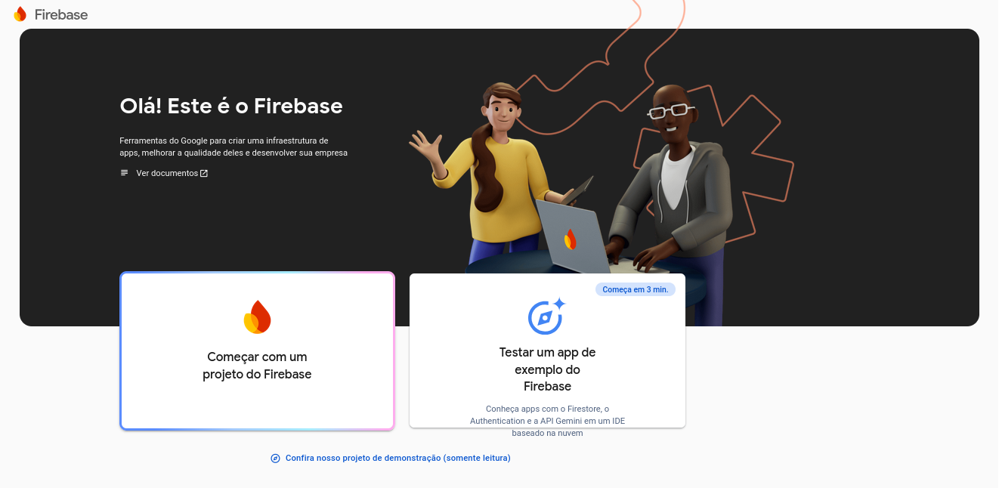

2. Escolha um nome para o projeto e confirme quando estiver pronto para continuar a configuração.

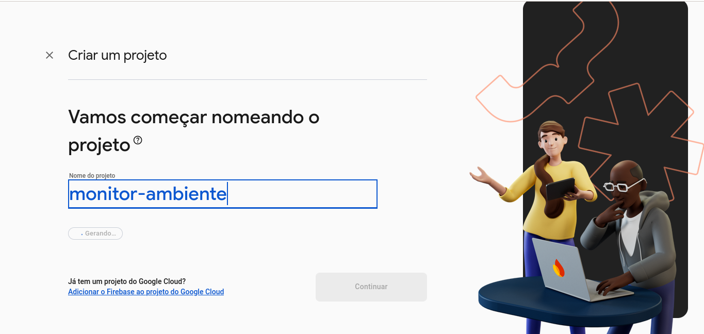

3. Para continuar será preciso aceitar os Termos do Google Analytics. 

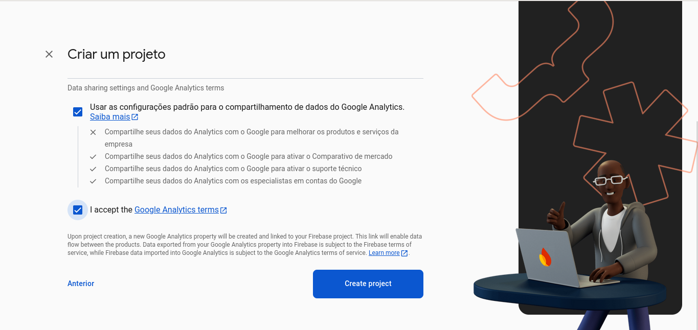

4. Após a criação do projeto, você será redirecionado para o Dashboard.


### Passo 4: Registrando um Aplicativo

1. Acesse as **Configurações do Projeto** no **Dashboard** do seu projeto do Firebase. 
Clique no ícone de engrenagem no canto superior esquerdo e, em seguida, na opção **Configurações do Projeto**.

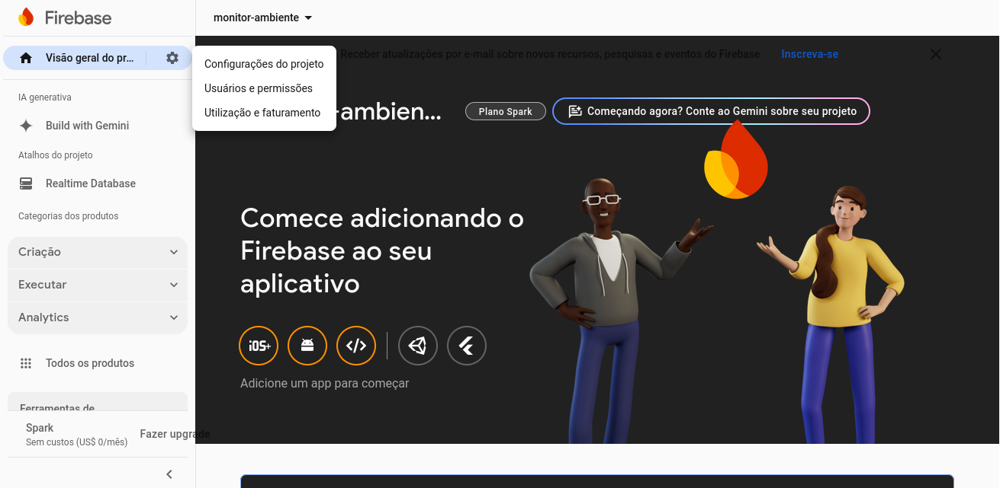

2. Na aba **Geral**, na seção *Seus aplicativos*, registre um Aplicativo Web clicando na opção no ícone `<\>`. 
Escolha um nome para o aplicativo e então continue para o Console.

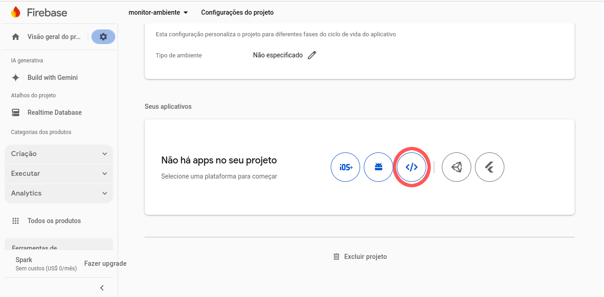

3. Copie (sem as aspas) e guarde a chave de API do seu aplicativo, posteriormente ela será usada no código do ESP32. 
Para ver a chave de API vá para **Configurações do Projeto > Seus aplicativos**. 

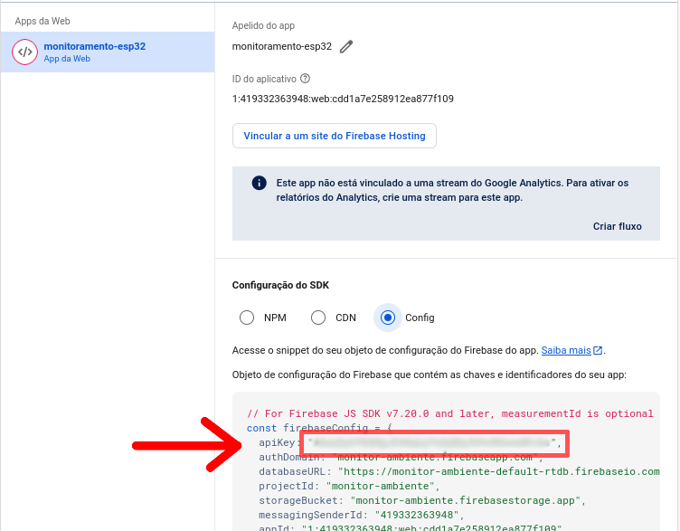

> **Mantenha sua chave de API em segredo** para evitar acessos não autorizados ao seu Firebase.


### Passo 5: Criando o banco de dados no Firebase Realtime Database

1. Vá para o Dashboard do seu projeto no Firebase e acesse o menu **Criação > Realtime Database**

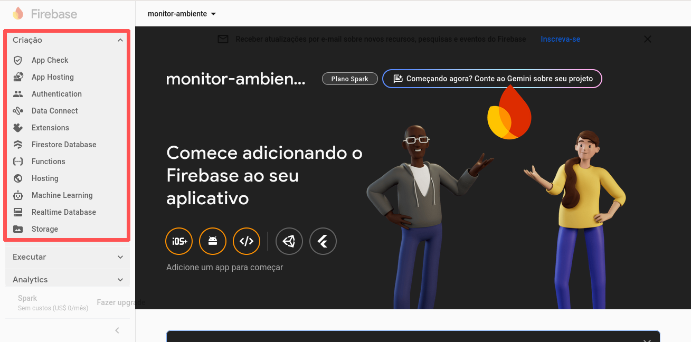

4. Na página do *Realtime Database* clique em **Criar banco de dados** e escolha a região que o banco deve estar localizado.

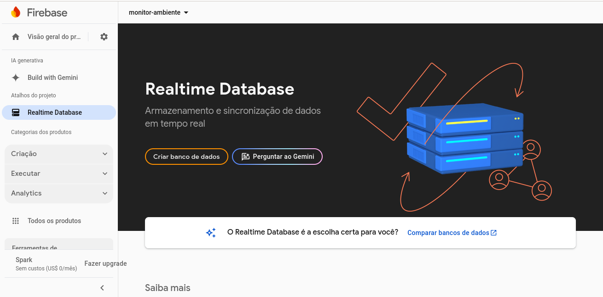

5. Configure o banco para o **modo de teste**. Por ter maior flexibilidade de acesso, esse modo permite 
a prototipação rápida de projeto.

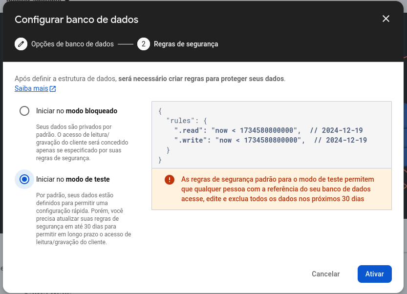

> O modo de teste **não deve ser utilizado para projetos de uso público** ou em ambiente de produção. No ambiente de produção, configure regras de segurança adequadas no Firebase Realtime Database para proteger seus dados

6. Finalmente, copie a URL do banco. A página do *Realtime Database* mostra várias informações uteis sobre seu banco,
copie o trecho que informa um link para o seu banco, ele será utilizado no código posteriormente.

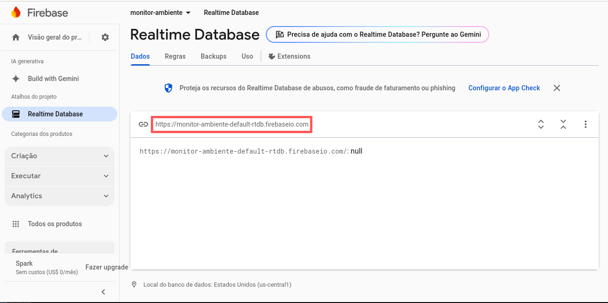
---

## Montagem do Circuito

A conexão do sensor DHT22 ao ESP32 é bem simples. O sensor possui 4 pinos:  
- **VCC**: Conecte ao pino 3.3V do ESP32  
- **SDA**: Conecte ao pino GPIO 4 do ESP32 (ou outro pino 
digital)
- **NC**: Não utilizado.
- **GND**: Conecte ao pino GND do ESP32

Caso o sensor DHT22 não tenha um resistor de pull-up interno, coloque um resistor de 10kΩ entre o pino `SDA` e o `VCC`.

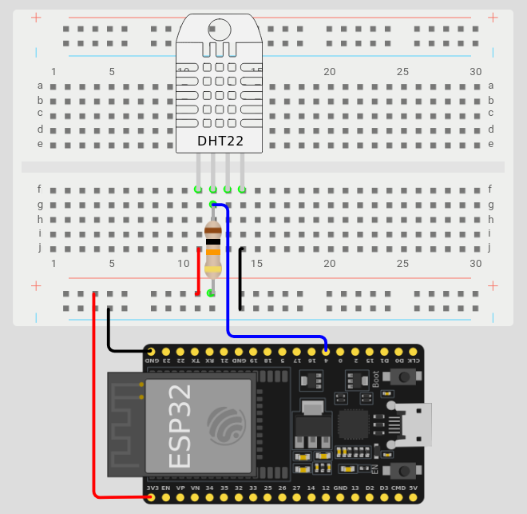

---

## Programação

### Passo 1: Importando as bibliotecas
```cpp
#include <WiFi.h>
#include <DHT.h>

#include <Firebase_ESP_Client.h>
#include "addons/TokenHelper.h"
```

### Passo 2: Definindo constantes e variáveis de configuração

Substitua os valores entre aspas pelos dados do seu banco de dados e rede Wi-Fi.

```cpp
#define NOME_WIFI "nome-da-rede-wifi"
#define SENHA_WIFI "senha-do-wifi"

#define CHAVE_API "sua-chave-de-api"
#define URL_BANCO "url-do-seu-banco"
```

```cpp
FirebaseData fbdo;      // usado para transferência de dados
FirebaseAuth auth;      // usado para autenticação do Firebase
FirebaseConfig config;  // configuração do Firebase

// objeto do sensor, mude o '4' para 
// a porta do ESP32 na qual o SDA
// do DHT está conectado caso seja diferente 
DHT sensorDHT(4, DHT22); 
```

### Passo 3: Conectando ao Wi-Fi
```cpp
void conectarWifi() {
  // inicia a conexão
  WiFi.begin(NOME_WIFI, SENHA_WIFI);
  
  Serial.print("Connecting to WiFi ..");

  // aguarda até que a conexão esteja 
  // estabelecida
  while (WiFi.status() != WL_CONNECTED) {
    Serial.print('.');
    delay(1000);
  }

  // mostra o endereço do dispositivo
  Serial.print(' ');
  Serial.println(WiFi.localIP());
  Serial.println();
}
```

### Passo 4: Conectando ao Firebase

Para ter acesso ao seu banco de dados Realtime Database, é necessário realizar a autenticação utilizando
os dados do seu banco.

```cpp
void conectarFirebase() {
  // configura as informações do banco
  config.api_key = CHAVE_API;
  config.database_url = URL_BANCO;

  Serial.print("Fazendo login no Firebase: ");
  
  // cria um usuário padrão
  if (Firebase.signUp(&config,&auth,"","")) {
    Serial.println("SUCESSO");
    
  } else {
    Serial.printf("ERRO\n%s\n", config.signer.signupError.message.c_str());
    while(true) {}
  }
  
  // configura função resposável por gerenciar
  // o estado do token de autenticação
  config.token_status_callback = tokenStatusCallback;

  // faz autenticação no Firebase
  Firebase.begin(&config, &auth);
  Firebase.reconnectWiFi(true);
}
```

### Passo 5: Lendo dados de ambiente
```cpp
float umidade = sensorDHT.readHumidity();        // lê umidade
float temperatura = sensorDHT.readTemperature(); // lê temperatura
```

### Passo 6: Enviando os dados para o Firebase
```cpp
void registrarDados(float umidade, float temperatura) {
  Serial.println("Enviando dados...");
  
  // Cria estrutura no banco de dados e atualiza o valores de 
  // seus campos
  //
  // ambiente:
  //    temperatura
  //    umidade

  if (Firebase.RTDB.setFloat(&fbdo, "ambiente/temperatura", temperatura)) {
    Serial.println("temperatura = " + String(temperatura) + "ºC");
    
  } else {
    Serial.println("ERRO: "+ fbdo.errorReason());
  }

  if (Firebase.RTDB.setFloat(&fbdo, "ambiente/umidade", umidade)) {
    Serial.println("umidate = " + String(umidade) + "%");
    
  } else {
    Serial.println("ERRO: "+ fbdo.errorReason());
  }
}
```

### Código Completo
```cpp
#include <WiFi.h>
#include <DHT.h>

#include <Firebase_ESP_Client.h>
#include "addons/TokenHelper.h"

#define NOME_WIFI "nome-da-rede-wifi"
#define SENHA_WIFI "senha-do-wifi"

#define CHAVE_API "sua-chave-de-api"
#define URL_BANCO "url-do-seu-banco"

FirebaseData fbdo;
FirebaseAuth auth;
FirebaseConfig config;

DHT sensorDHT(4, DHT22); 

void conectarWifi() {
  WiFi.begin(NOME_WIFI, SENHA_WIFI);
  
  Serial.print("Connecting to WiFi ..");
  while (WiFi.status() != WL_CONNECTED) {
    Serial.print('.');
    delay(1000);
  }
  Serial.print(' ');
  Serial.println(WiFi.localIP());
  Serial.println();
}

void conectarFirebase() {
  config.api_key = CHAVE_API;
  config.database_url = URL_BANCO;

  Serial.print("Fazendo login no Firebase: ");
  
  if (Firebase.signUp(&config,&auth,"","")) {
    Serial.println("SUCESSO");
    
  } else {
    Serial.printf("ERRO\n%s\n", config.signer.signupError.message.c_str());
    while(true) {}
  }
  
  config.token_status_callback = tokenStatusCallback;
  Firebase.begin(&config, &auth);
  Firebase.reconnectWiFi(true);
}

void registrarDados(float umidade, float temperatura) {
  Serial.println("Enviando dados...");
  
  if (Firebase.RTDB.setFloat(&fbdo, "ambiente/temperatura", temperatura)) {
    Serial.println("temperatura = " + String(temperatura) + "ºC");
    
  } else {
    Serial.println("ERRO: "+ fbdo.errorReason());
  }

  if (Firebase.RTDB.setFloat(&fbdo, "ambiente/umidade", umidade)) {
    Serial.println("umidate = " + String(umidade) + "%");
    
  } else {
    Serial.println("ERRO: "+ fbdo.errorReason());
  }
}

void setup() {
  Serial.begin(115200);

  conectarWifi();
  conectarFirebase();

  sensorDHT.begin();
}

void loop() {
  delay(2000);
  
  float umidade = sensorDHT.readHumidity();
  float temperatura = sensorDHT.readTemperature();

  if (isnan(umidade) || isnan(temperatura)) {
    Serial.println("ERRO: falha na leitura dos dados de ambiente");
    return;
  }
  
  registrarDados(umidade, temperatura);
}
```

### Execução do Programa

1. O microcontrolador inicia e tenta se conectar à rede Wi-Fi.

2. Após a conexão, ele faz login no Firebase.

3. O sensor DHT22 começa a ler dados de temperatura e umidade.

4. A cada 2 segundos, os dados lidos do sensor são enviados para o banco de dados Firebase.

5. O processo se repete continuamente.

### Visualizando dados no Firebase

Os dados enviados podem ser visualizados em tempo real pela página do *Realtime Database*

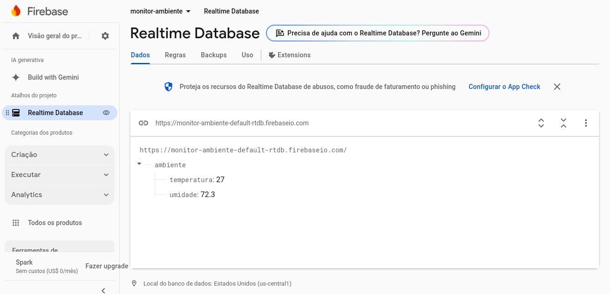

---

## Teste e Validação

1. **Testando a Leitura do Sensor**: Abra o monitor serial e verifique se a temperatura e a umidade estão sendo lidas corretamente.

2. **Validação do Firebase**: Acesse o Firebase Realtime Database e verifique se os dados estão sendo atualizados conforme esperado.

3. **Conectividade**: Verifique se o ESP32 está conseguindo se conectar ao Wi-Fi e ao Firebase sem erros.

---

## Expansões e Melhorias

- **Notificações**: Adicionar funcionalidades de notificações (via email ou push) quando a temperatura ou umidade atingir um limite crítico.

- **Interface Web**: Criar uma interface web simples para visualizar as leituras de temperatura e umidade em tempo real.

- **Histórico de Dados**: Armazenar as leituras no Firebase por mais tempo para gerar gráficos e análises.

- **Novos dados**: Adicionar novos sensores para coleta mais detalhada de dados de ambiente, como dados de qualidade de ar, usando o sensor de gás MQ-135.

---

## Referências

- [Documentação Firebase](https://firebase.google.com/docs)
- [Biblioteca DHT para Arduino](https://github.com/adafruit/DHT-sensor-library)

- [Biblioteca Firebase ESP32](https://github.com/mobizt/FirebaseClient)

---